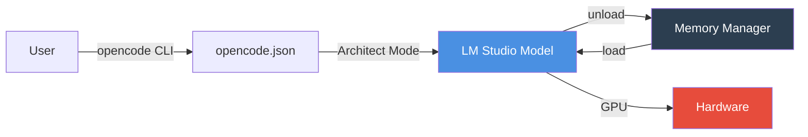

# Windows 11 Local Coding Setup

### 32GB RAM · LM Studio + opencode

  
  

**CLI-first local LLM orchestration for 32GB RAM systems.**  
Run a 35B model locally on your rig with LM Studio and opencode.

---

## 🎯 Meta-Objectives

| Objective | Detail |
|:---|:---|
| **Enable Local Coding** | LM Studio + opencode for single-model inference |
| **GPU-Accelerated Inference** | Hardware-accelerated inference via LM Studio |
| **Single-Active-Model** | Only one model resident in memory at a time |
| **CLI-First** | All setup via Windows Terminal — no GUI required |

---

## 🏗 Architecture

**Key Constraints:**
- **Single Active Model**: Only one model resident in memory at a time
- **32k Context / 1 Concurrency**: Required for 32GB RAM stability

---

## 📁 Documentation Structure

| File | Purpose |
|:---|:---|
| [`QUICKSTART.md`](QUICKSTART.md) | Step-by-step CLI setup guide |
| [`SETUP.md`](SETUP.md) | LM Studio Daemon setup and model configuration |
| [`CONFIG.md`](CONFIG.md) | `opencode.json` schema & lifecycle |
| [`NOTES.md`](NOTES.md) | Design rationale & authoritative references |

---

## ⚡ Quick Links

- [Start Setup](QUICKSTART.md) — Get running in 5 minutes
- [Configure opencode](CONFIG.md) — Memory policy & model definitions
- [Technical Notes](NOTES.md) — Context limits, concurrency, and constraints

---

*Optimize. Iterate. Deploy.*

